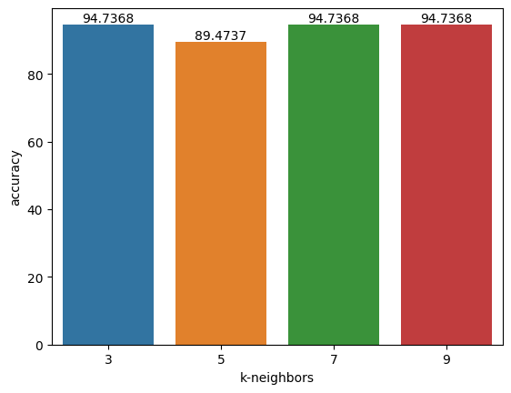
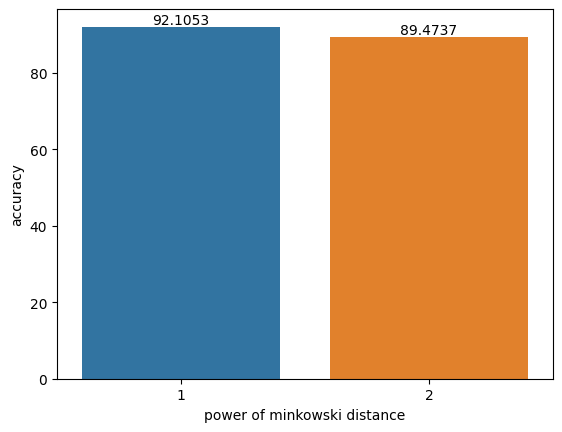
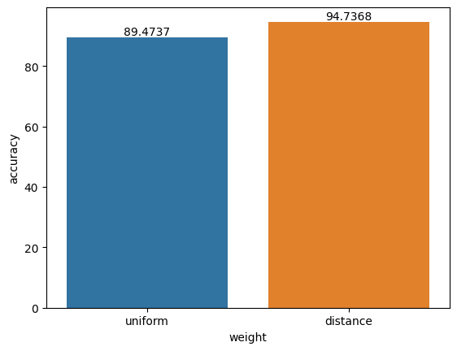

# k-Nearest Neighbor

k-NN (k-Nearest Neighbors) adalah salah satu algoritma machine learning yang paling sederhana yang digunakan untuk melakukan klasifikasi atau regresi pada data.

<center>
\(
\begin{align*}
⟨x^{[i]}, y^{[i]}⟩ ∈ D \qquad (|D| = n) \tag{1}
\end{align*}
\)
</center>

## Component of learning
---
k-NN tidak melibatkan proses pembelajaran seperti pada algoritma pembelajaran mesin lainnya. Sebaliknya, k-NN hanya menyimpan data training dan menggunakan data tersebut untuk melakukan prediksi pada data test. Oleh karena itu, k-NN sering dianggap sebagai algoritma _lazy learning_ atau _instance-based learning_.

### Hypothesis
---
Kumpulan dari tetangga terdekat

Hyperparameter:

- Nilai k: Menentukan jumlah tetangga terdekat yang akan digunakan untuk melakukan klasifikasi atau regresi
- Metrik jarak: Menentukan metode pengukuran jarak antara titik data. Beberapa metrik jarak yang umum digunakan adalah _euclidean distance_, _manhattan distance_, dan _minkowski distance_
<center>
\(
\begin{align*}
d(x^{(i)}, x^{(j)}) = \left( \sum_{k=1}^{p} \left| x_k^{(i)} - x_k^{(j)} \right| ^m \right) ^{1/m}  \tag{2}
\end{align*}
\)
</center>
- Bobot jarak: Menentukan apakah tetangga terdekat akan diberi bobot berdasarkan jarak mereka. Bobot yang umum digunakan adalah _uniform_ dan _distance_
<center>
\(
\begin{align*}
w^{(i)} = \frac{1}{d(x^{(i)}, x^{(j)})^2}  \tag{3}
\end{align*}
\)
</center>

### Paramaters
---
Tidak ada, karena k-NN termasuk _instance-based learning_ atau _nonparametric method_

### Learning algorithm
---
Dalam k-NN, tidak ada model pembelajaran yang dihasilkan selama fase training. Oleh karena itu, k-NN tidak memiliki learning algorithm.

## Pseudocode
---
### Fitting model
---
#### Input:
- D: dataset training yang terdiri dari n titik data dengan m fitur dan label kelas atau nilai target

#### Output:
- model k-NN yang terdiri dari dataset training D

#### Proses:
``` py
for i = 1, …, n in n-dimensional training dataset D:
    store training example ⟨X[i], y[i]⟩
```

### Cari neighbors
---
#### Input:
- model: dataset training yang telah disimpan sebagai model k-NN
- x: titik data test yang akan diprediksi kelasnya
- k: jumlah tetangga terdekat yang akan digunakan untuk melakukan klasifikasi
- p: pangkat dari metrik jarak yang digunakan untuk menghitung jarak antara titik data

#### Output
- k-closest_point: daftar point tetangga terdekat denga titik x
- k-closest_distance: daftar jarak tetangga terdekat denga titik x

#### Proses:
``` py
initialize k-closest_point = []
initialize k-closest_distance = []

for i = 1, …, n in n-dimensional model:
	current distance := d(x, x[i])

	if current distance < k-closest_distance[-1]:
		k-closest_distance[-1] = current distance
		k-closest_point[-1] = x[i]

		sort k-closest_distance, ascending order
		sort k-closest_point, by k-closest_distance
```

### Clasification
---
#### Input:
- model: dataset training yang telah disimpan sebagai model k-NN
- x: titik data test yang akan diprediksi kelasnya
- w: bobot dari setiap data

#### Output
- y_pred: kelas prediksi dari titik data uji x

#### Proses:
``` py
compute y_pred by (4)
```

<center>
\(
\begin{align*}
Pr(Y = j | X = x_0) = \frac{1}{K} \sum_{i∈N_0} w^{(i)} I (y_i = j) \tag{4}
\end{align*}
\)
</center>

### Regretion
---
#### Input:
- model: dataset training yang telah disimpan sebagai model k-NN
- x: titik data test yang akan diprediksi kelasnya
- w: bobot dari setiap data

#### Output
- y_pred: nilai target prediksi dari titik data uji x

#### Proses:
``` py
compute y_pred by (5)
```

<center>
\(
\begin{align*}
\hat{f}(x_0) = \frac{\sum_{i=1}^{k} w^{(i)} y_i}{\sum_{i=1}^{k} w^{(i)}}  \tag{5}
\end{align*}
\)
</center>

## Implementasi
---
### Simple Application
---
#### Import
``` py
from sklearn.datasets import load_iris
from sklearn.model_selection import train_test_split
from sklearn.neighbors import KNeighborsClassifier

import matplotlib.pyplot as plt
import seaborn as sns
```

``` py
import sys
sys.path.append('../../advanced_ml')
from ml_from_scratch.neighbors import KNeighborsClassifier as ScratchKNClassifier
```

#### Load data
``` py
iris = load_iris()
X = iris.data
y = iris.target
```

#### Split data
``` py
X_train, X_test, y_train, y_test = train_test_split(X, y, random_state=13)
```

#### Simple model
``` py
clf = ScratchKNClassifier()
clf.fit(X_train, y_train)
y_pred = clf.predict(X_test)
```

#### Accuracy
``` py
num_correct_pred = (y_pred == y_test).sum()
accuracy = (num_correct_pred / y_test.shape[0]) * 100

print('model accuracy: %.2f%%' % accuracy)
```

```
>> model accuracy: 89.47%
```

### Experiment dengan hyperparameter
---
#### Hyperparameter k (jumlah tetangga terdekat)
``` py
ks = [3, 5, 7, 9]
k_accurations = []

for k in ks:
    clf = ScratchKNClassifier(n_neighbors=k)
    clf.fit(X_train, y_train)
    y_pred = clf.predict(X_test)

    num_correct_pred = (y_pred == y_test).sum()
    accuracy = (num_correct_pred / y_test.shape[0]) * 100

    k_accurations.append(accuracy)
```

``` py
ax = sns.barplot(x=ks, y=k_accurations)
ax.set(xlabel='k-neighbors', ylabel='accuracy')
ax.bar_label(ax.containers[0])
plt.show()
```



#### Hyperparameter p (power dari minkowski distance)
``` py
ps = [1, 2]
p_accurations = []

for p in ps:
    clf = ScratchKNClassifier(p=p)
    clf.fit(X_train, y_train)
    y_pred = clf.predict(X_test)

    num_correct_pred = (y_pred == y_test).sum()
    accuracy = (num_correct_pred / y_test.shape[0]) * 100

    p_accurations.append(accuracy)
```

``` py
ax = sns.barplot(x=ps, y=p_accurations)
ax.set(xlabel='power of minkowski distance', ylabel='accuracy')
ax.bar_label(ax.containers[0])
plt.show()
```



#### Hyperparameter weights
``` py
ws = ['uniform', 'distance']
w_accurations = []

for w in ws:
    clf = ScratchKNClassifier(weights=w)
    clf.fit(X_train, y_train)
    y_pred = clf.predict(X_test)

    num_correct_pred = (y_pred == y_test).sum()
    accuracy = (num_correct_pred / y_test.shape[0]) * 100

    w_accurations.append(accuracy)
```

``` py
ax = sns.barplot(x=ws, y=w_accurations)
ax.set(xlabel='weight', ylabel='accuracy')
ax.bar_label(ax.containers[0])
plt.show()
```



### Membandingkan dengan library sklearn
---
#### Prediksi menggunakan sklearn model
``` py
sklearn_model = KNeighborsClassifier(n_neighbors=3, p=1, weights='distance')
sklearn_model.fit(X_train, y_train)
sklearn_pred = sklearn_model.predict(X_test)
```

``` py
sklearn_num_correct_pred = (sklearn_pred == y_test).sum()
sklearn_accuracy = (sklearn_num_correct_pred / y_test.shape[0]) * 100
```

#### Prediksi menggunakan scratch model
``` py
scratch_model = ScratchKNClassifier(n_neighbors=3, p=1, weights='distance')
scratch_model.fit(X_train, y_train)
scratch_pred = scratch_model.predict(X_test)
```

``` py
scratch_num_correct_predictions = (scratch_pred == y_test).sum()
scratch_accuracy = (scratch_num_correct_predictions / y_test.shape[0]) * 100
```

#### Bandingkan hasil
``` py
print('sklearn model accuracy: %.2f%%' % sklearn_accuracy)
print('scratch model accuracy: %.2f%%' % scratch_accuracy)
```

```
>> sklearn model accuracy: 97.37%
>> scratch model accuracy: 97.37%
```

## References
---
- Materi kelas Pacmann Advanced Machine Learning : Nearest Neighbor
- [STAT 479: Machine Learning Lecture Notes](https://sebastianraschka.com/pdf/lecture-notes/stat479fs18/02_knn_notes.pdf)
