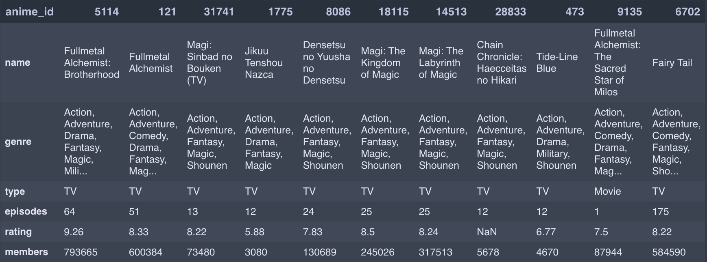
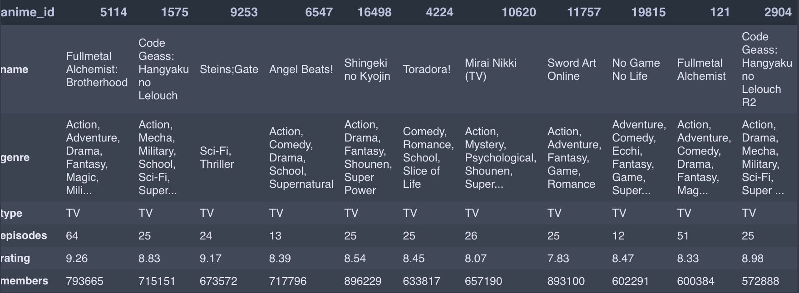
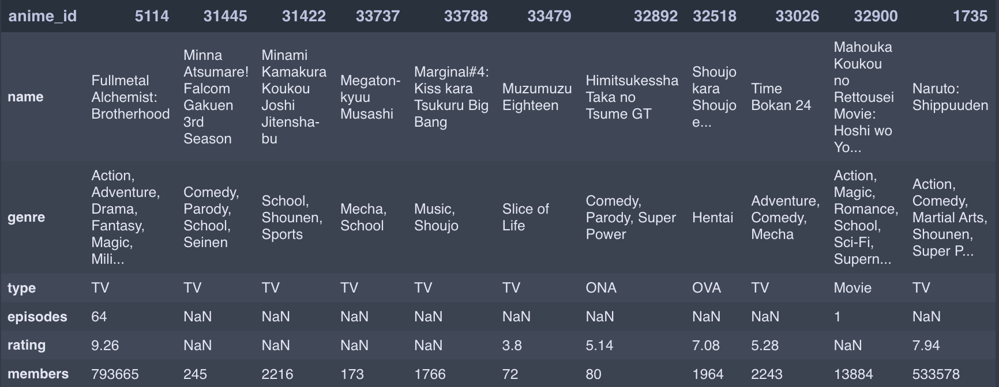
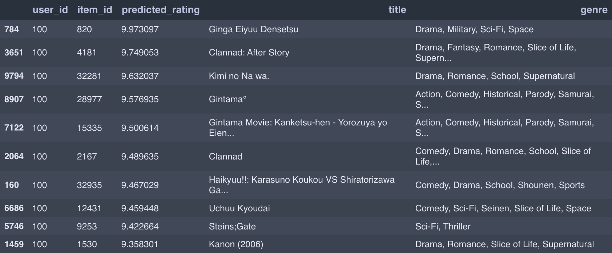
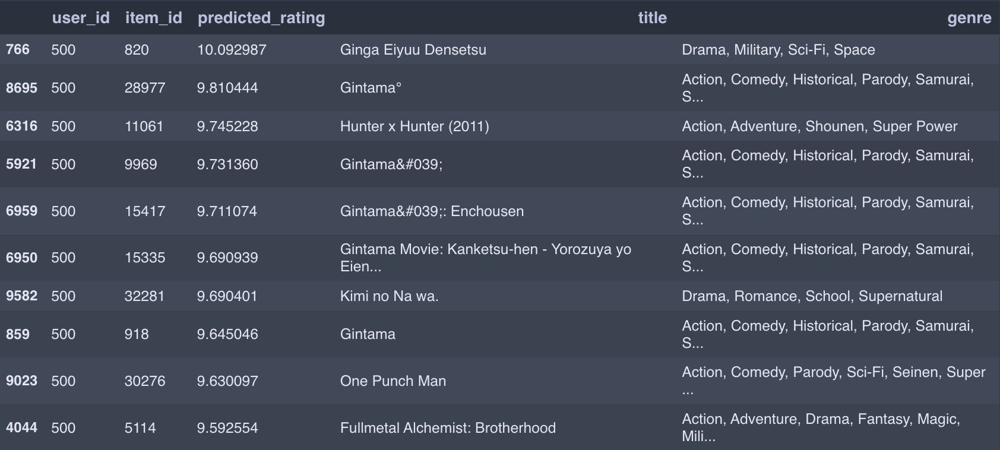

# Anime Recommender System

[Source code](https://github.com/zain3ie/recomender_system)

## Business Objectives
---

Dunia anime sangat luas, ada hingga ribuan judul yang tersedia. Penggemar anime sering kali harus bergantung pada pengetahuan mereka sendiri atau rekomendasi dari teman-teman untuk menemukan anime baru. Ini dapat menjadi tantangan, terutama bagi penggemar yang baru mengenal anime. Tanpa panduan, mungkin merasa sulit untuk menemukan anime yang sesuai dengan selera mereka diantara banyak pilihan.

Memilih anime yang tidak sesuai dengan preferensi pribadi dapat mengakibatkan pengalaman menonton yang kurang memuaskan. Beberapa penggemar mungkin menghabiskan waktu menonton anime yang akhirnya tidak mereka nikmati. Beberapa anime populer mungkin mendapatkan banyak perhatian, sementara anime yang bagus tetapi kurang dikenal bisa saja terlupakan.

Salah satu solusi untuk mengatasi masalah tersebut adalah dengan mengembangkan algoritma rekomendasi yang dapat menganalisis preferensi penggemar berdasarkan riwayat menonton dan berdasarkan penilaian terhadap anime yang di tonton. Kemudian algoritma ini memberikan rekomendasi anime yang sesuai. Ini dapat membantu penggemar anime menemukan anime baru yang lebih cocok dengan minat mereka dan menghindari potensi kekecewaan.

## Recommender System
---

Karena setiap orang mempunyai karakter kesukaan yang berbeda-beda, maka rekomendasi yang tepat adalah *personalized recomender system*. Kemudian kita akan menggunakan sistem *hybrid* yang merupakan gabungan dari *content based filtering* dan *colaborative filtering*.

### Content based filtering
---

*Content based filtering* adalah teknik dalam sistem rekomendasi yang memberikan rekomendasi berdasarkan kesesuaian antara preferensi pengguna dengan karakteristik anime yang telah diketahui sebelumnya.

    

#### Workflow

1.  *Feature extraction*

	Sistem mengumpulkan data mengenai karakteristik dari setiap anime. Dalam projek ini kita akan menggunakan *genre*, *type*, jumlah episode, *rating*, dan jumlah *member*.

2. *User profile*

	Sistem memahami preferensi pengguna dengan riwayat anime yang ditonton. Dalam hal ini kita akan melihat anime terakhir yang ditonton.

3. *Feature comparison*

	Sistem membandingkan vektor fitur dari *user profile* dengan vektor fitur dari anime yang tersedia.

4. Rekomendasi

	Berdasarkan perbandingan fitur, sistem memberikan rekomendasi kepada pengguna. Anime yang memiliki kesesuaian tertinggi dengan profil pengguna akan direkomendasikan.

#### Modelling

1. Importing data
    1. Load data
    2. Check data shapes and types
    3. Check duplicates data
    4. Data cleaning

2. Data preparation
    1. Numerical data
    2. Categorical data (with OHE)
    3. Combine numerical and categorical data

3. Content based recommendations: using last activity data
    1. Create similarity functions
        - Jaccard similarity
        - Euclidean similarity
        - Cosine similarity
        - Pearson correlation similarity
    2. Find similar anime based on user last watch anime

### Collaborative filtering dengan Funk SVD
---

Funk SVD (*Singular Value Decomposition*) adalah salah satu teknik yang digunakan dalam c*ollaborative filtering* untuk menghasilkan rekomendasi personalisasi kepada pengguna berdasarkan data historis anime yang ditonton.

    

#### Workflow

1. Pengumpulan data

    Data penggunaan yang mencakup interaksi pengguna dengan anime (misalnya rating yang diberikan) dikumpulkan dan disimpan dalam bentuk *utility matrix*.

2. Inisialisasi

    *Utility matrix* diinisialisasi dengan nilai-nilai awal yang kecil atau secara acak

3. Optimisasi

    Model Funk SVD melatih *utility matrix* untuk meminimalkan kesalahan prediksi terhadap data penggunaan yang ada. Ini dilakukan dengan mengoptimalkan fungsi tujuan yang mencoba meminimalkan perbedaan antara nilai aktual dan nilai prediksi dalam *utility matrix*.

4. Penyesuaian faktor laten

    Selama pelatihan, model Funk SVD menyesuaikan *utility matrix* dengan menghasilkan faktor-faktor laten yang mewakili karakteristik tersembunyi dari pengguna dan anime. Model ini mencoba untuk memahami pola-pola yang mendasari preferensi pengguna dan sifat anime.

5. Prediksi rekomendasi

    Setelah pelatihan selesai, model Funk SVD dapat digunakan untuk membuat prediksi peringkat atau perkiraan rating pengguna untuk anime yang belum dia interaksikan. Ini dilakukan dengan mengalikan matriks faktor laten pengguna dan matriks faktor laten anime yang diinginkan.

6. Rekomendasi

    Model menghasilkan daftar rekomendasi berdasarkan prediksi peringkat. Anime dengan prediksi peringkat tertinggi direkomendasikan kepada pengguna.

7. Evaluasi dan umpan balik

    Kualitas rekomendasi dievaluasi dengan mengukur sejauh mana prediksi model cocok dengan preferensi pengguna sebenarnya. Dalam siklus ini, umpan balik dari pengguna dapat digunakan untuk meningkatkan kualitas rekomendasi di masa mendatang.

#### Modelling

1. Importing data
    1. Load data
    2. Check data shapes and types
    3. Handle duplicates data

2. Modelling: funk SVD
    1. Mapping `user` and `anime`
    2. Generate user factor (𝑝𝑢) and item factor (𝑞𝑖)
    3. Training

3. Predictions/generating recommendation
    1. Predict recommendation of user-i to unrated item-j
    2. Predict recommendation of user-i to all their unrated items

## Implementation
---

### Data source
---

Dataset dalam project ini diambil dari Anime Recommendations Database di kaggle. Dataset dapat dilihat pada [link ini](https://www.kaggle.com/datasets/CooperUnion/anime-recommendations-database).

### Content based filtering
---

Dibawah merupakan hasil rekomendasi *content based filtering* dengan menggunakan berbagai fitur dan fungsi jarak. Walaupun semuanya merupakan rekomendasi terhadap anime `Fullmetal Alchemist: Brotherhood`, namun terdapat perbedaan pada rekomendasi yang diberikan.

#### Categorical features + jaccard similarity function

#### Numerical features + euclidean similarity function

#### Numerical + categorical features + pearson similarity function

### Collaboration filtering
---

Berikut hasil rekomendasi dari *colaborative filtering* untuk user id 100 dan user id 500.

#### Recommendation for user id 100

#### Recommendation for user id 500

## References
---

- Materi kelas Pacmann Recommender System
- [Introduction to Movie Recommendation System for Beginners](https://divyeshprajapati100.medium.com/introduction-to-movie-recommendation-system-for-beginners-a12987d94adc)

## Sorce code
---

- [recommender system](https://github.com/zain3ie/recomender_system)