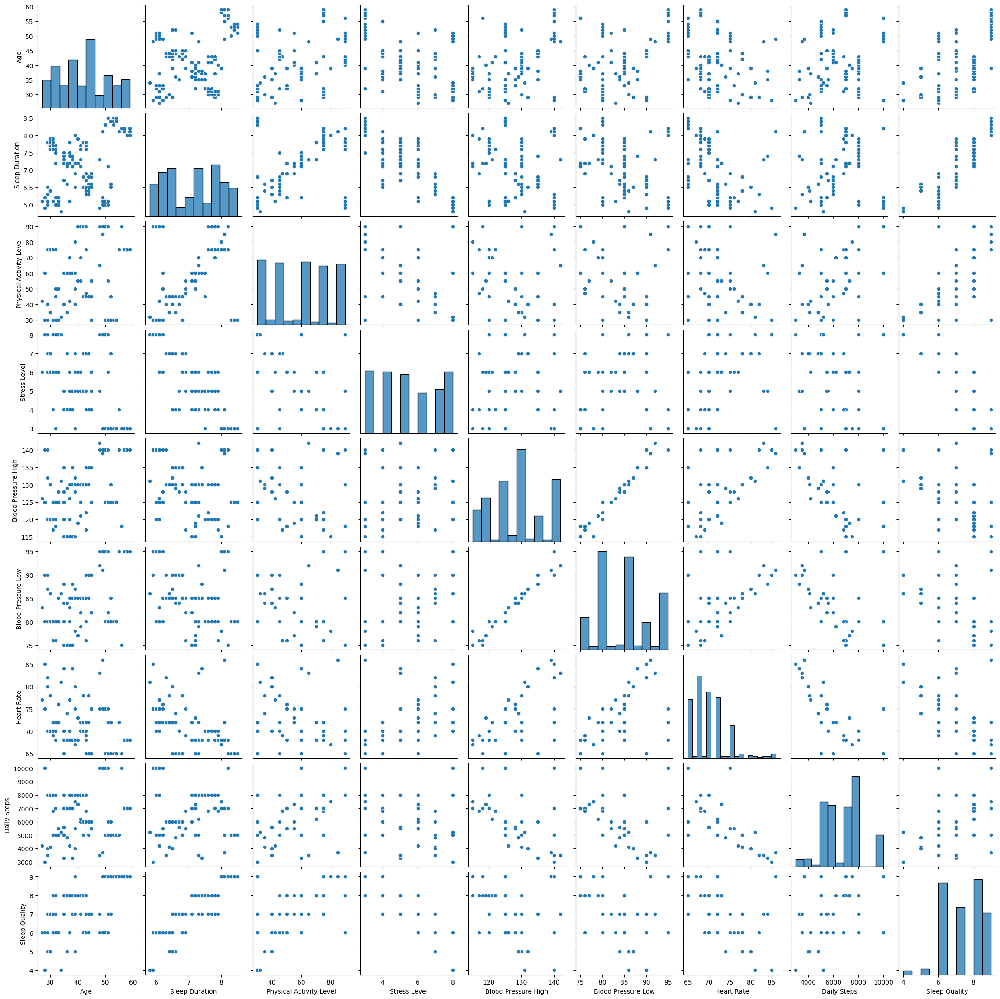
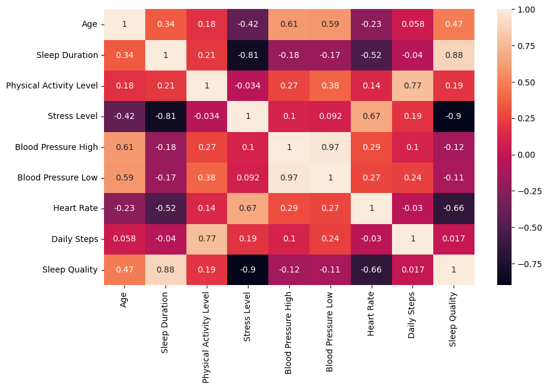
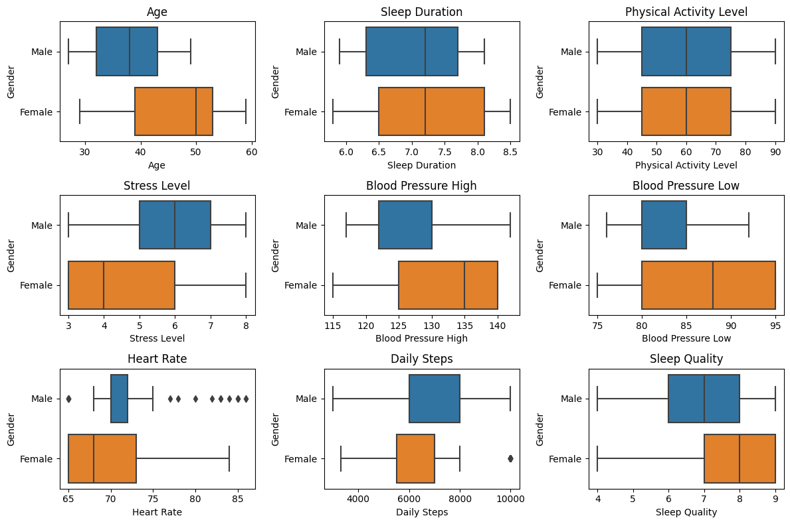
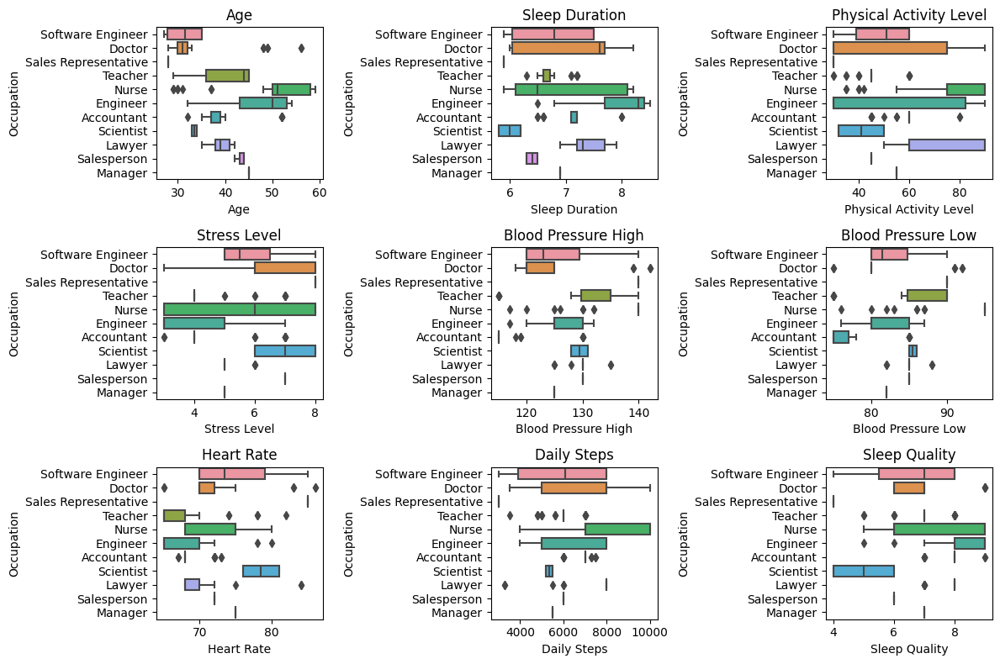
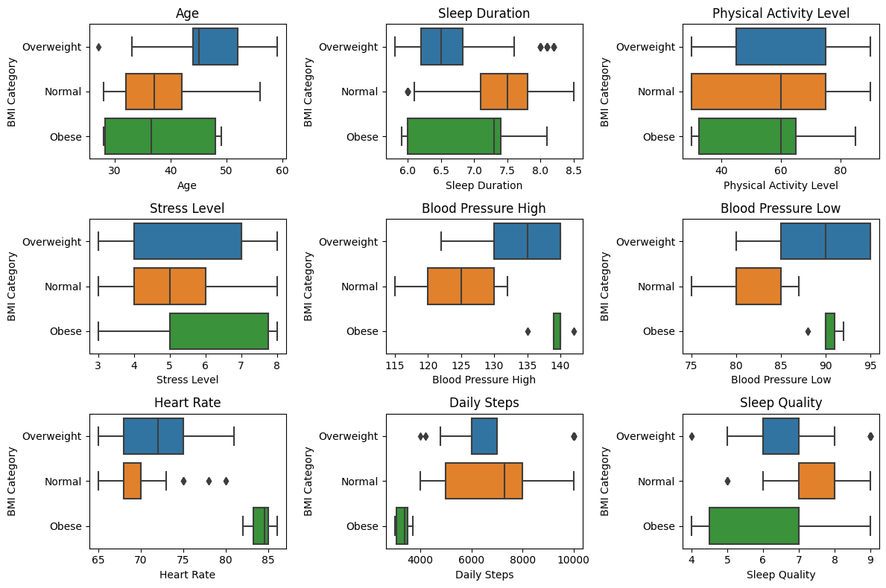

# Sleep Health Analysis

[Source code](https://github.com/zain3ie/statistics/tree/main/sleep%20health%20analysis)

## 1. Introduction
---
Dalam project ini kita akan menganalisa faktor-faktor yang dapat mempengaruhi kualitas tidur (sleep quality) seseorang. Informasi ini dapat digunakan untuk memberikan saran dan rekomendasi kepada individu atau kelompok untuk meningkatkan kebiasaan tidur mereka dan mencapai tidur yang lebih berkualitas.

### 1.1 Data sources
---
Dataset dalam project ini diambil dari __Sleep Health and Lifestyle Dataset__ di kaggle. Dataset dapat dilihat pada [link ini](https://www.kaggle.com/datasets/uom190346a/sleep-health-and-lifestyle-dataset).

### 1.2 Define the problem
---
- Variabel manakah pada data yang mempunyai pengaruh terhadap `Sleep Quality`?
- Apakah variabel `Gender` mempunyai hubungan yang kuat dengan `Sleep Quality`?
- Apakah variabel `Age` mempunyai hubungan yang kuat dengan `Sleep Quality`?
- Apakah variabel `Occupation` mempunyai hubungan yang kuat dengan `Sleep Quality`?
- Apakah variabel `Sleep Duration` mempunyai hubungan yang kuat dengan `Sleep Quality`?
- Apakah variabel `Physical Activity Level` mempunyai hubungan yang kuat dengan `Sleep Quality`?
- Apakah variabel `Stress Level` mempunyai hubungan yang kuat dengan `Sleep Quality`?
- Apakah variabel `BMI Category` mempunyai hubungan yang kuat dengan `Sleep Quality`?
- Apakah variabel `Blood Pressure` mempunyai hubungan yang kuat dengan `Sleep Quality`?
- Apakah variabel `Heart Rate` mempunyai hubungan yang kuat dengan `Sleep Quality`?
- Apakah variabel `Daily Step` mempunyai hubungan yang kuat dengan `Sleep Quality`?
- Bagaimana kesimpulan akhirnya? dan rekomendasi apakah yang dapat dilakukan?

## 2. Exploratory data analysis
---
### 2.1. Numerical variable
---
Pertama, kita akan melihat distribusi dan hubungan dari masing-masing numerical variable



Kemudian, kita akan berapa nilai koefisien korelasi dari setiap numerical variable



Berdasarkan `pairplot` dan `histmap` di atas, maka dapat diambil kesimpulan sebagai berikut:

1. `Sleep Quality` mempunyai korelasi yang kuat dengan `Sleep Duration`
2. `Sleep Quality` mempunyai korelasi terbalik yang kuat dengan `Stress Level`
3. `Sleep Quality` mempunyai korelasi terbalik yang cukup kuat dengan `Hearth Rate`

### 2.2 Categorical variable
---
#### 2.2.1 Distribusi by `Gender`



Berdasarkan boxplot `Gender` terhadap `Sleep Quality`, `Female` cenderung mempunyai `Sleep Quality` yang lebih baik dibandingkan dengan `Male`

#### 2.2.2 Distribusi by `Occupation`



Berdasarkan boxplot `Occupation` terhadap `Sleep Quality`, maka:

1. `Scienteist` cenderung mempunyai `Sleep Quality` yang rendah
2. `Software Engineer` cenderung mempunyai `Sleep Quality` yang sedang
3. `Nurse` cenderung mempunyai `Sleep Quality` dari sedang hingga baik
4. `Engineer` cenderung mempunyai `Sleep Quality` yang baik

#### 2.2.3 Distribusi by `BMI Category`



Berdasarkan boxplot `BMI Category` terhadap `Sleep Quality`, semakin normal `BMI Category` seseorang, maka cenderung semakin baik `Sleep Quality`-nya (`Normal` > `Overweight` > `Obese`)

## 3. Statistical test
### 3.1 Statistical test `Gender`
Kita akan menguji apakah ada perbedaan signifikan antara jenis kelamin laki-laki dan perempuan pada variable `Gender` dalam menentukan `Sleep Quality`. Karena tedapat 2 kategori, kita akan melakukan uji t 2 sample independent. Dengan hasil sebagai berikut:

---
```
Banyak sampel untuk laki-laki = 189
Banyak sampel untuk perempuan = 185
==================================================
Hipotesis dan taraf signifikansi:
H0 : μ male - μ female <= 0
H1 : μ male - μ female > 0
alpha = 0.05
==================================================
Statistik hitung = -5.874547760454642
P value = 4.708223266344652e-09
```

Kesimpulan : Berdasarkan hasil uji statistik di atas, nilai p-value yang diperoleh < 0.05, sehingga diambil keputusan untuk menolak H0, yang artinya ada perbedaan signifikan `Sleep Quality` antara Laki-laki dan Perempuan

### 3.1 Statistical test `Occupation`
Kita akan menguji apakah ada perbedaan signifikan dari kategori di dalam variable `Occupation` dalam menentukan `Sleep Quality`. Karena terdapat lebih dari 2 kategori, kita akan melakukan uji ANOVA. Dengan hasil sebagai berikut:

```
Hipotesis dan taraf signifikansi:
H0 : μ software_engineer = μ doctor = μ sales_representative = μ teacher = μ nurse = μ engineer = μ accountant = μ scientiest = μ lawyer = μ salesperson = μ manager
H1 : Setidaknya terdapat satu yang berbeda
alpha = 0.05
==================================================
Hasil dari uji ANOVA:
               df      sum_sq    mean_sq          F        PR(>F)
Occupation   10.0  241.907020  24.190702  30.022167  6.393557e-42
Residual    363.0  292.491376   0.805761        NaN           NaN
```

Kesimpulan : Berdasarkan hasil uji statistik di atas, nilai p-value yang diperoleh < 0.05, sehingga diambil keputusan untuk menolak H0. yang artinya setidaknya ada perbedaan signifikan `Sleep Quality` pada salah satu bidang `Occupation`

### 3.1 Statistical test `BMI Category`
Kita akan menguji apakah ada perbedaan signifikan dari kategori di dalam variable `BMI Category` dalam menentukan `Sleep Quality`. Karena terdapat lebih dari 2 kategori, kita akan melakukan uji ANOVA. Dengan hasil sebagai berikut:

```
Hipotesis dan taraf signifikansi:
H0 : μ normal = μ overweight = μ obese
H1 : Setidaknya terdapat satu yang berbeda
alpha = 0.05
==================================================
Hasil dari uji ANOVA:
                      df      sum_sq    mean_sq          F        PR(>F)
Q('BMI Category')    2.0   56.685333  28.342666  22.011391  9.257969e-10
Residual           371.0  477.713063   1.287636        NaN           NaN
```

Kesimpulan : Berdasarkan hasil uji statistik di atas, nilai p-value yang diperoleh < 0.05, sehingga diambil keputusan untuk menolak H0.
yang artinya setidaknya ada perbedaan signifikan `Sleep Quality` pada salah satu `BMI Category`

## 4. Regression model
Berdasarkan hasil EDA dan pengujian statistik sebelumnya, kita mengetahui bahwa terdapat beberapa variabel yang signifikan memengaruhi `Sleep Quality`.Variabel yang akan kita gunakan dalam model regresi yaitu:

- `Sleep Duration`
- `Stress Level`
- `Hearth Rate`
- `Gender`
- `Occupation`
- `BMI Category`

```
                            OLS Regression Results
==============================================================================
Dep. Variable:     Q('Sleep Quality')   R-squared:                       0.941
Model:                            OLS   Adj. R-squared:                  0.938
Method:                 Least Squares   F-statistic:                     354.4
Date:                Sat, 08 Jul 2023   Prob (F-statistic):          6.91e-208
Time:                        16:04:00   Log-Likelihood:                -68.895
No. Observations:                 374   AIC:                             171.8
Df Residuals:                     357   BIC:                             238.5
Df Model:                          16
Covariance Type:            nonrobust
======================================================================================================
                                         coef    std err          t      P>|t|      [0.025      0.975]
------------------------------------------------------------------------------------------------------
Intercept                             10.1898      0.701     14.528      0.000       8.810      11.569
Gender[T.Male]                         0.0417      0.064      0.647      0.518      -0.085       0.168
Occupation[T.Doctor]                  -0.3869      0.097     -4.009      0.000      -0.577      -0.197
Occupation[T.Engineer]                -0.2165      0.078     -2.769      0.006      -0.370      -0.063
Occupation[T.Lawyer]                   0.0126      0.093      0.136      0.892      -0.170       0.196
Occupation[T.Manager]                 -0.3716      0.312     -1.189      0.235      -0.986       0.243
Occupation[T.Nurse]                   -0.0718      0.080     -0.897      0.371      -0.229       0.086
Occupation[T.Sales Representative]    -1.7958      0.258     -6.956      0.000      -2.303      -1.288
Occupation[T.Salesperson]             -0.7231      0.107     -6.774      0.000      -0.933      -0.513
Occupation[T.Scientist]               -1.1075      0.181     -6.135      0.000      -1.462      -0.752
Occupation[T.Software Engineer]       -0.5492      0.170     -3.236      0.001      -0.883      -0.215
Occupation[T.Teacher]                 -0.9185      0.084    -10.909      0.000      -1.084      -0.753
Q('BMI Category')[T.Obese]             0.4917      0.198      2.488      0.013       0.103       0.880
Q('BMI Category')[T.Overweight]        0.0903      0.064      1.419      0.157      -0.035       0.215
Q('Sleep Duration')                    0.4602      0.051      9.029      0.000       0.360       0.560
Q('Stress Level')                     -0.3204      0.031    -10.457      0.000      -0.381      -0.260
Q('Heart Rate')                       -0.0598      0.011     -5.671      0.000      -0.080      -0.039
==============================================================================
Omnibus:                       49.293   Durbin-Watson:                   1.407
Prob(Omnibus):                  0.000   Jarque-Bera (JB):              275.426
Skew:                          -0.343   Prob(JB):                     1.56e-60
Kurtosis:                       7.148   Cond. No.                     3.31e+03
==============================================================================

Notes:
[1] Standard Errors assume that the covariance matrix of the errors is correctly specified.
[2] The condition number is large, 3.31e+03. This might indicate that there are
strong multicollinearity or other numerical problems.
```

Dari hasil summary di atas, ada beberapa variable yang tidak signifikan:

- `Gender` tidak signifikan -> keluarkan dari variable
- `Ocuupation`(`Lawyer`, `Manager`, dan `Nurse`) tidak signifikan.
	- `Lawyer` & `Nurse` -> tetap, karena jumlah datanya cukup banyak dan tidak ada kategori yang serupa untuk digabung
	- `Manager` -> hapus, karena jumlah datanya hanya 1
- `BMI Category`(`Overweight`) tidak signifikan -> digabung dengan BMI Normal, sehingga kategori di `BMI Category` hanya tinggal `Normal` dan `Obese`

```
                            OLS Regression Results
==============================================================================
Dep. Variable:     Q('Sleep Quality')   R-squared:                       0.940
Model:                            OLS   Adj. R-squared:                  0.938
Method:                 Least Squares   F-statistic:                     435.4
Date:                Sat, 08 Jul 2023   Prob (F-statistic):          1.13e-210
Time:                        16:04:00   Log-Likelihood:                -70.491
No. Observations:                 373   AIC:                             169.0
Df Residuals:                     359   BIC:                             223.9
Df Model:                          13
Covariance Type:            nonrobust
======================================================================================================
                                         coef    std err          t      P>|t|      [0.025      0.975]
------------------------------------------------------------------------------------------------------
Intercept                             10.1533      0.687     14.773      0.000       8.802      11.505
Occupation[T.Doctor]                  -0.3693      0.078     -4.734      0.000      -0.523      -0.216
Occupation[T.Engineer]                -0.2021      0.070     -2.879      0.004      -0.340      -0.064
Occupation[T.Lawyer]                   0.0404      0.071      0.567      0.571      -0.100       0.180
Occupation[T.Nurse]                   -0.0113      0.064     -0.175      0.861      -0.138       0.116
Occupation[T.Sales Representative]    -1.7729      0.252     -7.024      0.000      -2.269      -1.277
Occupation[T.Salesperson]             -0.6178      0.078     -7.917      0.000      -0.771      -0.464
Occupation[T.Scientist]               -1.0501      0.172     -6.118      0.000      -1.388      -0.713
Occupation[T.Software Engineer]       -0.5053      0.161     -3.146      0.002      -0.821      -0.189
Occupation[T.Teacher]                 -0.8535      0.073    -11.713      0.000      -0.997      -0.710
Q('BMI Category')[T.Obese]             0.4693      0.196      2.395      0.017       0.084       0.855
Q('Sleep Duration')                    0.4578      0.051      8.980      0.000       0.358       0.558
Q('Stress Level')                     -0.3177      0.031    -10.379      0.000      -0.378      -0.257
Q('Heart Rate')                       -0.0589      0.010     -5.694      0.000      -0.079      -0.039
==============================================================================
Omnibus:                       60.562   Durbin-Watson:                   1.377
Prob(Omnibus):                  0.000   Jarque-Bera (JB):              345.159
Skew:                          -0.506   Prob(JB):                     1.12e-75
Kurtosis:                       7.603   Cond. No.                     3.22e+03
==============================================================================

Notes:
[1] Standard Errors assume that the covariance matrix of the errors is correctly specified.
[2] The condition number is large, 3.22e+03. This might indicate that there are
strong multicollinearity or other numerical problems.
```

## 5. Conclusion and recommendation
---
Setelah dilakukan analisis statistik, kita mendapatkan beberapa insight yang di mana dapat menjawab beberapa pertanyaan yang telah disebutkan sebelumnnya

- Variabel manakah pada data yang mempunyai pengaruh terhadap `Sleep Quality`?

    Berdasarkan hasil analisa di atas, terdapat 5 faktor yang dapat mempengaruhi `Sleep Quality` yaitu:

    1. `Sleep Duration` -> Semakin lama tidur, maka cenderung semaik baik `Sleep Quality`-nya
    2. `Stress Level` -> Semakin tinggi stress level seseorang, maka akan semakin jelek `Sleep Quality`-nya
    3. `Heart Rate` -> Semakin tinggi heart rate seseorang, maka akan semakin jelek juga `Sleep Quality`-nya
    4. `Occupation` -> Pekerjaan juga berpengaruh terhadap sleep quality, Engineer cenderung memiliki `Sleep Quality` yang baik, software engineer cenderung memeiliki `Sleep Quality` yang sedang, scientist cenderung memiliki `Sleep Quality` yang jelek
    5. `BMI Category` -> Seseorang dengan BMI normal cenderung memiliki sleep quality yang lebih baik dibandingkan dengan seseorang yang obesitas'

- Apakah variabel `Gender` mempunyai hubungan yang kuat dengan `Sleep Quality`?

    Dari hasil OLS, `Gender` tidak mempunyai hubungan yang kuat dengan `Sleep Quality`, ditandai dengan nilai p-value sebesar 0.518 yang artinya perbedaan `Gender` baik `Male` maupun `Female` tidak berpengaruh signifikan terhadap `Sleep Quality`

- Apakah variabel `Age` mempunyai hubungan yang kuat dengan `Sleep Quality`?

	Dari hasil EDA, `Age` mempunyai hubungan yang kurang kuat dengan `Sleep Quality`, ditandai dengan nilai koefisien korelasi sebesar 0.47

- Apakah variabel `Occupation` mempunyai hubungan yang kuat dengan `Sleep Quality`?

    Dari tes ANOVA, `Occupation` mempunyai hubungan yang kuat dengan `Sleep Quality`, ditandai dengan nilai p-value sebesar kurang dari 0.05 yang artinya setidaknya ada satu kategori yang berpengaruh signifikan

- Apakah variabel `Sleep Duration` mempunyai hubungan yang kuat dengan `Sleep Quality`?

    Dari hasil EDA, `Sleep Duration` mempunyai hubungan sangat kuat dengan `Sleep Quality`, ditandai dengan nilai koefisien korelasi sebesar 0.88

- Apakah variabel `Physical Activity Level` mempunyai hubungan yang kuat dengan `Sleep Quality`?

    Dari hasil EDA, `Physical Activity Level` mempunyai hubungan yang tidak kuat dengan `Sleep Quality`, ditandai dengan nilai koefisien korelasi sebesar 0.19

- Apakah variabel `Stress Level` mempunyai hubungan yang kuat dengan `Sleep Quality`?

    Dari hasil EDA, `Stress Level` mempunyai hubungan yang sangat kuat namun berkebalikan dengan `Sleep Quality`, ditandai dengan nilai koefisien korelasi sebesar -0.9

- Apakah variabel `BMI Category` mempunyai hubungan yang kuat dengan `Sleep Quality`?

    Dari tes ANOVA, `BMI Category` mempunyai hubungan yang kuat dengan `Sleep Quality`, ditandai dengan nilai p-value sebesar kurang dari 0.05 yang artinya setidaknya ada satu kategori yang berpengaruh signifikan

- Apakah variabel `Blood Pressure` mempunyai hubungan yang kuat dengan `Sleep Quality`?

    Dari hasil EDA, `Blood Pressure` baik high maupun low tidak mempunyai hubungan yang kuat dengan `Sleep Quality`, ditandai dengan nilai koefisien korelasi sebesar -0.12 dan -0.11

- Apakah variabel `Heart Rate` mempunyai hubungan yang kuat dengan `Sleep Quality`?

    Dari hasil EDA, `Heart Rate` mempunyai hubungan yang kuat namun berkebalikan dengan `Sleep Quality`, ditandai dengan nilai koefisien korelasi sebesar -0.66

- Apakah variabel `Daily Step` mempunyai hubungan yang kuat dengan `Sleep Quality`?

    Dari hasil EDA, `Daily Step` mempunyai hubungan yang tidak kuat dengan `Sleep Quality`, ditandai dengan nilai koefisien korelasi sebesar 0.017

- Bagaimana kesimpulan akhirnya? dan rekomendasi apakah yang dapat dilakukan?

    Ada 5 faktor yang mempengaruhi sleep quality sesorang, yaitu `Sleep Duration`, `Stress Level`, `Heart Rate`, `Occupation`, dan `BMI Category`. Hal-hal yang dapat dilakukan untuk meningkatkan `Sleep Quality` adalah:

    1. Menambah jam tidur sesuai dengan standar jam tidur manusia sesuai usia
    2. Mengurangi tingkat strees (berhubungan juga dengan heart rate), baik itu dengan berlibur atau olah raga ringan setiap hari
    3. Mengurangi berat badan bagi yang obesitas, hal ini dapat dilakukan dengan menjaga pola hidup sehat

## Reference
- [Simulasi Final Project - Asistensi Kelas Statistics for Business Pacmann](https://drive.google.com/file/d/1P2wdojhHsSgX5kfAu2Uz-IUfd-CSnB_m/view?usp=sharing)
- [Relationship B/W 😴 and BMI depends on Age?](https://www.kaggle.com/code/sasakitetsuya/relationship-b-w-and-bmi-depends-on-age)

## Sorce code
- [sleep health analysis](https://github.com/zain3ie/statistics/tree/main/sleep%20health%20analysis)